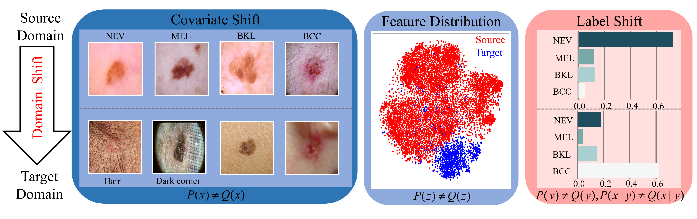

# Iterative resampling noise-robust domain adaptation (IRNDA) for cross-domain skin disease diagnosis under class imbalance
This is the official code of the paper "**Iterative resampling noise-robust domain adaptation (IRNDA) for
cross-domain skin disease diagnosis under class imbalance**".
## Introduction

An applied scenario of the coexistence of covariate shift and label shift can be observed in cross-domain skin disease diagnosis. This scenario reflects that the source and target domains differ not only in visual features but also in their potential class label distributions. (The acronyms used are as follows: NEV stands for nevus; MEL refers to melanoma; BKL indicates benign keratosis-like lesions; BCC represents basal cell carcinoma. Nevus and benign keratosis-like lesions are benign skin diseases, while melanoma and basal cell carcinoma are skin cancers.)
## Installation
This implementation is based on [Transfer-Learning-Library](https://github.com/thuml/Transfer-Learning-Library). Please take a look at the Transfer-Learning-Library for installation instructions.
## Preparing datasets
**HAM:** download HAM dataset from [here](https://doi.org/10.7910/DVN/DBW86T). <br>
**PAD:** download PAD dataset from [here](https://data.mendeley.com/datasets/zr7vgbcyr2/1).<br>
**Derm7pt-C:** download Derm7pt-C dataset from [here](https://derm.cs.sfu.ca/Welcome.html).<br>
**Skin dermoscopic image datasets of different domains:** download skin dermoscopic image datasets of different domains from [here](https://gitlab.com/dlr-dw/isic_download).
## CSV files for 4 datasets
You can find them [here](IRNDA-maindata/metadata).
## Training
Our benchmark is modified based on [Transfer-Learning-Library](https://github.com/thuml/Transfer-Learning-Library). Please refer to the Transfer-Learning-Library Readme for more details on running command jobs.
```
For example:
python train.py --targetfile '../data/metadata/B.csv' --targetimage '../data/B' --domain 'B' --e_cutoff -9.5 -a resnet50 --epochs 20 --seed 1 --log logs/IRNDA/H_B
python train.py --targetfile '../data/metadata/BLH.csv' --targetimage '../data/BLH' --domain 'BLH' --e_cutoff -11.5 -a resnet50 --epochs 20 --seed 1 --log logs/IRNDA/H_BLH
```
## Acknowledgment
This code is built on [Transfer-Learning-Library](https://github.com/thuml/Transfer-Learning-Library) and [DebiasedPL](https://github.com/frank-xwang/debiased-pseudo-labeling). We thank the authors for sharing their codes.
